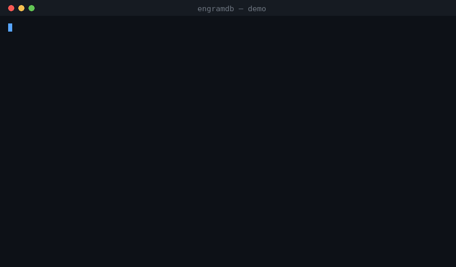
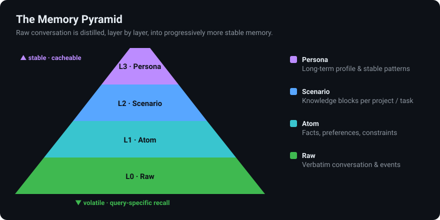
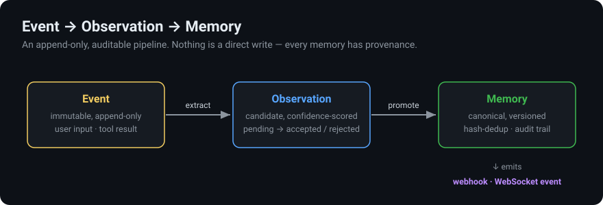
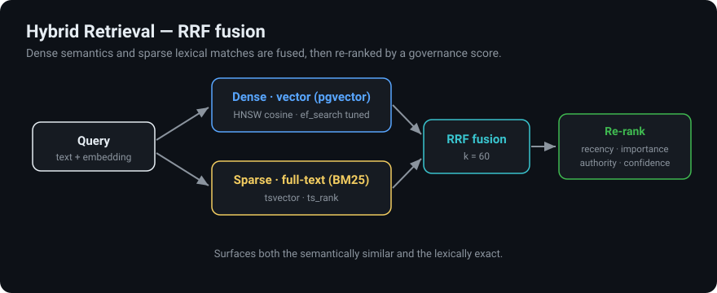

<p align="center">
  <strong>EngramDB</strong><br>
  <em>SQL-native, auditable, event-sourced memory + state backend for agentic AI</em>
</p>

<p align="center">
  <a href="https://github.com/ioteverythin/EngramDB/actions"></a>
  <a href="https://pypi.org/project/engramdb/"></a>
  <a href="LICENSE"></a>
  <a href="https://www.python.org/"></a>
</p>

<p align="center">
  
</p>

<p align="center">
  <em>Agents remember. The next one starts where the last left off — no re-introductions.</em>
</p>

---

## Why EngramDB?

Most agentic frameworks treat memory as an afterthought — a JSON blob, a vector-only store, or a black-box service.  **EngramDB** is different:

| Feature | EngramDB | Typical alternatives |
|---------|---------------|----------------------|
| **Storage** | PostgreSQL — one DB you already know | Redis, Pinecone, custom |
| **Memory pyramid** | First-class `raw`→`atom`→`scenario`→`persona` layers in SQL | Flat records or files on disk |
| **Temporal validity** | Bitemporal facts: query any point in time, plain SQL ([docs](docs/temporal-model.md)) | Latest-value only |
| **Contradictions** | Conflicts resolved explicitly at write time — supersede or flag `disputed` + link | Stale facts silently coexist |
| **Forgetting** | Decay + reconsolidation + audited erasure, GDPR-ready ([docs](docs/forgetting.md)) | Grows forever, or `DELETE` with no trace |
| **Reflection** | Sleep-time consolidation derives insights from memory clusters, each traceable to its evidence ([docs](docs/reflection.md)) | Memories stay flat — no synthesis |
| **Poisoning resistance** | Writes carry an `origin` that caps their authority; untrusted low-confidence writes are quarantined ([docs](docs/provenance.md)) | A scraped page can write itself in as authoritative |
| **Audit trail** | Every mutation is versioned (lossless snapshots); every retrieval is logged | Fire-and-forget |
| **Search** | Hybrid **RRF fusion** of dense vector + sparse full-text (BM25), re-ranked by recency + importance + authority + confidence | Vector-only |
| **Context assembly** | Budget-capped, layer-ordered, injection-safe prompt block via `/memories/assemble-context` | Raw dump into prompt |
| **Tenant isolation** | API keys bound to their owner — a key for user A can't touch user B | Client-asserted / none |
| **State machine** | First-class tasks with validated transitions | Ad-hoc status fields |
| **Event sourcing** | Event → Observation → Memory pipeline | Direct writes |
| **Auth** | API-key with scopes, per-key expiry | None / external |
| **Observability** | Prometheus metrics + structured logging + request tracing | DIY |
| **Webhooks** | HMAC-signed delivery with retry + audit | None |
| **Graph ops** | BFS traversal + shortest-path over memory links | Not supported |
| **SDK + CLI** | Typed async Python client + Click CLI | Curl only |
| **MCP Server** | Model Context Protocol for AI agent interop | Not supported |
| **Real-time** | WebSocket pub/sub for live memory events | Polling only |
| **Multi-tenant RLS** | PostgreSQL Row Level Security isolation | Application-level |
| **Explorer UI** | Built-in web dashboard for memory inspection | None |
| **Scheduled jobs** | Auto-consolidation, archiving, recency refresh | Manual |
| **TypeScript SDK** | Typed JS/TS client for Node.js & browser | Python only |
| **Self-hosted** | `docker compose up`, Apache-2.0 | SaaS lock-in |

> **Design note:** the memory-pyramid, RRF hybrid retrieval, and context-assembly
> features were informed by a detailed teardown of TencentDB Agent Memory — we
> adopted its best ideas while avoiding its security and correctness flaws. See
> [`docs/tencent-agent-memory-analysis.md`](docs/tencent-agent-memory-analysis.md).

---

## Architecture at a Glance

```
┌──────────────────┐
│   Agent / App    │
└────────┬─────────┘
         │  REST · MCP · WebSocket
┌────────▼─────────────────────────────────────────────┐
│                  FastAPI  /api/v1                     │
│  health · users · projects · runs · events           │
│  observations · memories · tasks · retrieval-logs    │
│  artifacts · memory-links · mcp · scheduler          │
│  + WebSocket /ws  ·  MCP /api/v1/mcp/message         │
│  + Explorer UI /explorer                             │
└────────┬─────────────────────────────────────────────┘
         │
┌────────▼─────────────────────────────────────────────┐
│              Service Layer                           │
│  EventService · ObservationService · MemoryService   │
│  RetrievalService · TaskService · RetrievalLogSvc    │
└────────┬─────────────────────────────────────────────┘
         │
┌────────▼─────────────────────────────────────────────┐
│           Repository Layer (async SQLAlchemy 2)      │
│  BaseRepository[T] + specialised repos               │
└────────┬─────────────────────────────────────────────┘
         │
┌────────▼─────────────────────────────────────────────┐
│        PostgreSQL 15+  ·  pgvector  ·  JSONB         │
└──────────────────────────────────────────────────────┘
```

### The Memory Pyramid

Raw conversation is distilled, layer by layer, into progressively more stable
memory. Higher layers bootstrap context cheaply; lower layers serve precise,
query-specific recall.

<p align="center">
  
</p>

### Core Pipeline: Event → Observation → Memory

<p align="center">
  
</p>

Every memory is identified by `(user_id, memory_key)`.  Updates create a
`MemoryVersion` snapshot before overwriting, giving you a full audit trail.

---

## Quick Start

### 0. Try it in 60 seconds — no setup

The GIF above is real output from the embeddable client. Run it yourself with
zero configuration (in-memory SQLite, no server, no API key):

```bash
pip install engramdb        # the embeddable client — numpy only
python examples/demo.py
```

It walks through short-term memory, promotion to long-term, semantic recall,
versioning, and context assembly.

> **Two distributions, one API.** `pip install engramdb` is the lightweight
> **embeddable client** (SQLite, zero config). To talk to a running server,
> `pip install "engramdb[remote]"` and use `engramdb.HttpClient`. The **server**
> itself is a separate package, `engramdb-server` (usually run via
> `docker compose up`).

### 1. Clone & Start

```bash
git clone https://github.com/engramdb/engramdb.git
cd engramdb
cp .env.example .env          # review & tweak
docker compose up -d           # Postgres + API
```

The API is available at **http://localhost:8100**.

### 2. Health Check

```bash
curl http://localhost:8100/api/v1/health
# {"status": "ok"}
```

### 3. Create a User

```bash
curl -X POST http://localhost:8100/api/v1/users \
  -H "Content-Type: application/json" \
  -d '{"name": "alice"}'
```

### 4. Store a Memory

```bash
curl -X POST http://localhost:8100/api/v1/memories/upsert \
  -H "Content-Type: application/json" \
  -d '{
    "user_id": "<USER_ID>",
    "memory_key": "pref:language",
    "memory_type": "semantic",
    "content": "Alice prefers Python.",
    "importance_score": 0.8
  }'
```

### 5. Search Memories

```bash
curl -X POST http://localhost:8100/api/v1/memories/search \
  -H "Content-Type: application/json" \
  -d '{
    "user_id": "<USER_ID>",
    "query": "What programming language does Alice like?",
    "top_k": 5
  }'
```

---

## Local Development

```bash
# Python 3.11+
make install          # pip install -e ".[dev]"
make up               # docker compose up -d (just the DB)
make migrate          # alembic upgrade head
make test-unit        # pytest tests/unit
make test-integration # pytest tests/integration (needs Postgres)
make lint             # ruff check + black --check + mypy
```

Or without Make:

```bash
pip install -e ".[dev]"
docker compose up -d db
alembic upgrade head
pytest tests/unit -v
```

---

## Hybrid Scoring

Retrieval fuses dense (vector) and sparse (full-text/BM25) rankings with
Reciprocal Rank Fusion, then re-ranks the fused candidates by a weighted
governance score:

<p align="center">
  
</p>

Every retrieval scores candidates with a weighted composite:

$$S = 0.45 \cdot \text{vector} + 0.20 \cdot \text{recency} + 0.15 \cdot \text{importance} + 0.10 \cdot \text{authority} + 0.10 \cdot \text{confidence}$$

| Signal | Source | Notes |
|--------|--------|-------|
| **Vector similarity** | Cosine distance via pgvector | IVFFlat index |
| **Recency** | Exponential decay, 72 h half-life | `updated_at` |
| **Importance** | Domain-supplied 0–1 | Set on upsert |
| **Authority** | Normalised authority_level | 0–10 → 0–1 |
| **Confidence** | Source confidence 0–1 | From observation |

Weights are configurable via environment variables (`SCORE_WEIGHT_*`).  When
no embedding is available, the vector weight is redistributed proportionally.

---

## Data Model Overview

| Entity | Description |
|--------|-------------|
| **User** | Tenant / owner |
| **Project** | Optional grouping |
| **AgentRun** | One agent invocation (session) |
| **Event** | Immutable record from a run |
| **Observation** | Candidate fact extracted from an event |
| **Memory** | Canonical knowledge unit (versioned, searchable) |
| **MemoryVersion** | Historical snapshot |
| **MemoryLink** | Typed edge between memories |
| **Task** | Work item with state machine |
| **TaskStateTransition** | State-change audit record |
| **RetrievalLog** | Search audit header |
| **RetrievalLogItem** | Per-memory score breakdown |
| **Artifact** | File / binary attachment |

See [docs/architecture.md](docs/architecture.md) for the full deep-dive.

---

## Task State Machine

```
         ┌──────────┐       ┌─────────────┐       ┌───────────┐
    ●───▶│ pending   │──────▶│ in_progress │──────▶│ completed │
         └─────┬────┘       └──────┬──────┘       └───────────┘
               │                   │
               │                   ├──▶ failed
               │                   └──▶ blocked
               │
               └──────────────────────▶ cancelled
```

Transitions are validated against an allow-list.  Each transition creates an
immutable audit record with `reason` and `triggered_by`.

---

## API Reference (Summary)

All endpoints live under `/api/v1`.

| Method | Path | Description |
|--------|------|-------------|
| `GET` | `/health` | Readiness check |
| `GET` | `/health/deep` | Deep health (DB + pgvector + memory count) |
| `GET` | `/version` | App version + feature flags |
| `GET` | `/metrics` | Prometheus metrics (root, not `/api/v1`) |
| | | |
| `POST` | `/users` | Create user |
| `POST` | `/projects` | Create project |
| `POST` | `/runs` | Create agent run |
| `PATCH` | `/runs/{id}/complete` | Mark run completed |
| `POST` | `/events` | Record event |
| `POST` | `/observations` | Record observation |
| `POST` | `/observations/extract-from-event` | Auto-extract from event |
| | | |
| `POST` | `/memories/upsert` | Create or update memory |
| `POST` | `/memories/search` | Hybrid search |
| `GET` | `/memories/{id}` | Get memory by ID |
| `GET` | `/memories` | List with filters |
| `PATCH` | `/memories/{id}/status` | Update status |
| `GET` | `/memories/{id}/versions` | Version history |
| `GET` | `/memories/{id}/timeline` | Supersession chain with per-generation diffs |
| `POST` | `/memories/{id}/invalidate` | Close a fact's validity window (no replacement) |
| `PATCH` | `/memories/{id}/pin` | Pin/unpin (exempt from decay + archival) |
| `DELETE` | `/memories/{id}` | Archive, or `?mode=erase` to hard-erase (needs `erase` scope) |
| `GET` | `/memories/{id}/links` | Related memories |
| `POST` | `/memory-links` | Create link |
| | | |
| `POST` | `/bulk/upsert` | Batch upsert (up to 100) |
| `POST` | `/bulk/search` | Batch search (up to 20 queries) |
| | | |
| `POST` | `/graph/expand` | BFS graph traversal from seed memory |
| `POST` | `/graph/shortest-path` | Shortest path between two memories |
| | | |
| `GET` | `/consolidation/duplicates` | Find exact duplicates |
| `POST` | `/consolidation/merge` | Merge two memories |
| `POST` | `/consolidation/auto` | Auto-consolidate all duplicates |
| `POST` | `/consolidation/reflect` | Run a sleep-time reflection pass |
| `GET` | `/consolidation/runs` | Reflection pass history (incl. skip reasons) |
| | | |
| `GET` | `/data/export` | Export memories as JSON |
| `POST` | `/data/import` | Import memories from JSON |
| | | |
| `GET` | `/forgetting/log` | Forgetting audit trail (decay, expiry, erasure) |
| `POST` | `/forgetting/decay` | Run importance decay (dry run by default) |
| `POST` | `/forgetting/archive` | Run retention archival (dry run by default) |
| `DELETE` | `/users/{id}/memories` | Erase all of a user's memories (needs `erase` scope) |
| | | |
| `GET` | `/provenance/policy` | Authority ceilings + quarantine rules in force |
| `GET` | `/provenance/quarantine` | Writes held back for review |
| `POST` | `/provenance/quarantine/{id}/review` | Approve into active recall, or reject |
| | | |
| `POST` | `/api-keys` | Create API key |
| `DELETE` | `/api-keys/{id}` | Revoke API key |
| `POST` | `/webhooks` | Register webhook |
| `GET` | `/webhooks` | List webhooks |
| `DELETE` | `/webhooks/{id}` | Delete webhook |
| | | |
| `POST` | `/tasks` | Create task |
| `PATCH` | `/tasks/{id}/transition` | State transition |
| `GET` | `/tasks/{id}` | Get task |
| `GET` | `/tasks` | List tasks |
| `POST` | `/retrieval-logs` | Create audit log |
| `POST` | `/artifacts` | Upload artifact metadata |
| `GET` | `/artifacts/{id}` | Get artifact |
| | | |
| `POST` | `/mcp/message` | MCP JSON-RPC 2.0 endpoint |
| `GET` | `/mcp/tools` | List available MCP tools |
| `GET` | `/scheduler/status` | Scheduler status |
| `POST` | `/scheduler/run/{job}` | Trigger maintenance job |
| `WS` | `/ws` | WebSocket real-time events |

Interactive docs: **http://localhost:8100/docs** (Swagger UI).

---

## Configuration

All settings are driven by environment variables (or `.env`):

| Variable | Default | Description |
|----------|---------|-------------|
| `APP_NAME` | `EngramDB` | Application name |
| `DATABASE_URL` | `postgresql+asyncpg://…` | Async Postgres URL |
| `EMBEDDING_PROVIDER` | `dummy` | `dummy`, `openai`, `cohere`, `sentence-transformers`, `ollama` |
| `EMBEDDING_DIMENSION` | `1536` | Vector dimension |
| `RETRIEVAL_DEFAULT_TOP_K` | `10` | Default search limit |
| `SCORE_WEIGHT_VECTOR` | `0.45` | Vector similarity weight |
| `SCORE_WEIGHT_RECENCY` | `0.20` | Recency weight |
| `SCORE_WEIGHT_IMPORTANCE` | `0.15` | Importance weight |
| `SCORE_WEIGHT_AUTHORITY` | `0.10` | Authority weight |
| `SCORE_WEIGHT_CONFIDENCE` | `0.10` | Confidence weight |
| `OPENAI_API_KEY` | — | Required if provider=openai |
| `OPENAI_EMBEDDING_MODEL` | `text-embedding-3-small` | OpenAI model |
| `COHERE_API_KEY` | — | Required if provider=cohere |
| `OLLAMA_BASE_URL` | `http://localhost:11434` | Ollama server URL |
| `OLLAMA_MODEL` | `nomic-embed-text` | Ollama embedding model |
| `REQUIRE_AUTH` | `false` | Enable API-key authentication |
| `ENABLE_WEBHOOKS` | `true` | Enable webhook delivery |
| `ENABLE_METRICS` | `true` | Enable Prometheus metrics |
| `ENABLE_FULLTEXT_SEARCH` | `true` | Enable tsvector full-text search |
| `ENABLE_ACCESS_TRACKING` | `true` | Track memory access patterns |
| `ACCESS_BOOST_FACTOR` | `0.05` | How much access frequency boosts importance |
| `ACCESS_BOOST_WINDOW_HOURS` | `168` | Access counting window (7 days) |
| `ENABLE_WEBSOCKET` | `true` | Enable WebSocket real-time events |
| `ENABLE_MCP` | `true` | Enable MCP server endpoint |
| `ENABLE_EXPLORER` | `true` | Enable Memory Explorer UI at `/explorer` |
| `ENABLE_SCHEDULER` | `true` | Enable scheduled maintenance jobs |
| `ENABLE_RLS` | `false` | Enable Row Level Security (run migration first) |
| `SCHEDULER_CONSOLIDATION_INTERVAL` | `3600` | Seconds between consolidation runs |
| `SCHEDULER_ARCHIVE_INTERVAL` | `7200` | Seconds between archive runs |
| `SCHEDULER_STALE_THRESHOLD_DAYS` | `90` | Archive memories older than N days |
| `ENABLE_TEMPORAL_VALIDITY` | `false` | Default retrieval to currently-valid facts only ([docs](docs/temporal-model.md)) |
| `ENABLE_CONTRADICTION_DETECTION` | `false` | Resolve conflicting facts at promotion time |
| `CONTRADICTION_STRATEGY` | `heuristic` | `heuristic` or `llm` (fails closed without a provider) |
| `CONTRADICTION_SIMILARITY_THRESHOLD` | `0.85` | Similarity above which two facts are compared |
| `CONTRADICTION_CANDIDATE_TOP_K` | `5` | Incumbents considered per new observation |
| `LLM_PROVIDER` | `none` | `none` or `openai` — powers `llm` strategies |
| `LLM_MODEL` | `gpt-4o-mini` | Model for LLM-backed strategies |
| `ENABLE_DECAY` | `false` | Ebbinghaus importance decay ([docs](docs/forgetting.md)) |
| `DECAY_HALF_LIFE_HOURS` | `720` | Importance half-life in hours (30 days) |
| `DECAY_FLOOR` | `0.05` | Importance never decays below this |
| `SCHEDULER_DECAY_INTERVAL` | `21600` | Seconds between decay runs |
| `ENABLE_RECONSOLIDATION` | `false` | Recall boosts a memory's importance |
| `RECONSOLIDATION_BOOST` | `0.02` | Per-recall importance bump (capped at 1.0) |
| `MCP_ENABLE_FORGET` | `false` | Expose the irreversible `forget_memory` MCP tool |
| `ENABLE_REFLECTION` | `false` | Sleep-time consolidation over memory clusters ([docs](docs/reflection.md)) |
| `REFLECTION_MIN_CLUSTER_SIZE` | `3` | Memories needed before a cluster is reflected on |
| `REFLECTION_SIMILARITY_THRESHOLD` | `0.75` | Cosine similarity to join a cluster |
| `SCHEDULER_REFLECTION_INTERVAL` | `86400` | Seconds between reflection passes |
| `ENABLE_POISONING_RESISTANCE` | `false` | Authority ceilings + quarantine by write origin ([docs](docs/provenance.md)) |
| `QUARANTINE_CONFIDENCE_THRESHOLD` | `0.6` | Untrusted writes below this confidence are quarantined |

---

## Examples

Run the demo scripts against a running instance:

```bash
# Event → Observation → Memory
python examples/scripts/demo_event_to_memory.py

# Hybrid memory search
python examples/scripts/demo_memory_search.py

# Task state machine
python examples/scripts/demo_task_flow.py
```

---

## Framework Integrations

### LangGraph / LangChain

A lightweight adapter is included at `app/adapters/langgraph_store.py`:

```python
from app.adapters.langgraph_store import EngramDBStore

store = EngramDBStore(base_url="http://localhost:8100/api/v1")
await store.put(user_id, "pref:color", "User likes blue.")
results = await store.search(user_id, "What colour?", top_k=3)
```

### Python SDK

```python
from app.sdk import EngramDBClient

async with EngramDBClient(
    base_url="http://localhost:8100",
    api_key="amdb_...",
) as client:
    # Upsert a memory
    memory = await client.upsert_memory(
        user_id=user_id,
        memory_key="pref:lang",
        memory_type="semantic",
        content="User prefers Python",
    )

    # Search
    results = await client.search_memories(
        user_id=user_id,
        query_text="What language?",
        top_k=5,
    )

    # Graph traversal
    graph = await client.expand_graph(memory["id"], max_hops=2)

    # Bulk operations
    batch = await client.bulk_upsert([item1, item2, item3])
```

### CLI

```bash
# Health check
engramdb health

# Memory statistics
engramdb stats

# Export/import
engramdb export --user-id <UUID> -o memories.json
engramdb import memories.json

# Maintenance
engramdb archive-stale --days 90
engramdb consolidate
engramdb recompute-recency
```

---

## MCP Server (Model Context Protocol)

EngramDB includes a built-in MCP server that lets AI agents (Claude, Cursor, custom agents) interact with memory through the standard Model Context Protocol:

```json
{
  "jsonrpc": "2.0",
  "method": "tools/call",
  "params": {
    "name": "store_memory",
    "arguments": {
      "user_id": "abc-123",
      "memory_key": "pref:language",
      "content": "User prefers Rust"
    }
  },
  "id": 1
}
```

**7 MCP tools**: `store_memory`, `recall_memories`, `get_memory`, `link_memories`, `record_event`, `explore_graph`, `consolidate_memories`

**Transports**: HTTP+SSE (for Cursor/Claude Desktop), stdio (for local agents)

---

## WebSocket Real-Time Events

Subscribe to live memory changes via WebSocket:

```javascript
const ws = new WebSocket('ws://localhost:8100/ws?channels=user:abc-123');
ws.onmessage = (event) => {
  const data = JSON.parse(event.data);
  // { event: "memory.created", data: { id: "...", memory_key: "..." } }
};
```

**Events**: `memory.created`, `memory.updated`, `memory.deleted`, `memory.consolidated`, `event.recorded`

---

## Memory Explorer UI

A built-in web dashboard for inspecting, searching, and debugging agent memories:

```
http://localhost:8100/explorer
```

Features: memory search, score visualization, real-time WebSocket event feed, type filtering, detail view with full score breakdown.

---

## TypeScript SDK

```typescript
import { EngramDB } from '@engramdb/sdk';

const db = new EngramDB({
  baseUrl: 'http://localhost:8000',
  apiKey: 'your-api-key',
});

const memory = await db.memories.upsert({
  userId: 'user-uuid',
  memoryKey: 'user_preference',
  content: 'User prefers dark mode',
});

const results = await db.memories.search({
  userId: 'user-uuid',
  queryText: 'What does the user prefer?',
});

// Real-time events
const ws = db.realtime(['user:user-uuid']);
```

See [sdks/typescript/README.md](sdks/typescript/README.md) for full docs.

---

## Row Level Security (Multi-Tenant Isolation)

EngramDB supports PostgreSQL Row Level Security for database-level tenant isolation:

```bash
# Run the RLS migration
alembic upgrade 004_add_rls

# Enable in settings
ENABLE_RLS=true
```

Three roles: `engramdb_anon` (read-only), `engramdb_user` (CRUD on own data), `engramdb_admin` (full access). Tenant context is set via `set_tenant_context(user_id)` before queries.

---

## Scheduled Maintenance

Built-in cron-based maintenance jobs:

| Job | Default Interval | Description |
|-----|-----------------|-------------|
| `consolidate_duplicates` | 1 hour | Auto-merge near-duplicate memories |
| `archive_stale` | 2 hours | Archive low-retention memories (audited) |
| `recompute_recency` | 30 min | Refresh recency scores for active memories |
| `cleanup_expired` | 1 hour | Retract memories past `expires_at` (audited) |
| `prune_access_logs` | 24 hours | Delete old access log entries |
| `distill_memories` | 6 hours | Roll atoms up the memory pyramid |
| `reflect_and_promote` | 24 hours | Sleep-time reflection — **requires `ENABLE_REFLECTION`** |
| `decay_importance` | 6 hours | Ebbinghaus decay — **requires `ENABLE_DECAY`** |

Configure via `SCHEDULER_*` environment variables. All jobs are individually
toggleable. `decay_importance` is double-gated: it needs both
`SCHEDULER_ENABLE_DECAY` and the `ENABLE_DECAY` feature flag, so a default
deployment decays nothing. See [docs/forgetting.md](docs/forgetting.md).

---

## Project Structure

```
engramdb/
├── app/
│   ├── api/v1/           # FastAPI routes (20 modules)
│   ├── core/             # Settings, errors, auth, middleware, metrics
│   ├── db/               # Engine, session, base
│   ├── mcp/              # Model Context Protocol server (JSON-RPC 2.0)
│   ├── models/           # SQLAlchemy domain models (17 tables)
│   ├── repositories/     # Data-access layer
│   ├── schemas/          # Pydantic v2 request/response
│   ├── services/         # Business logic (11 services)
│   ├── static/explorer/  # Memory Explorer UI (HTML/JS dashboard)
│   ├── utils/            # Hashing, scoring, embeddings, extra providers
│   ├── workers/          # Background tasks (archiver, scheduler)
│   ├── ws/               # WebSocket real-time events
│   ├── adapters/         # Framework integrations (LangGraph)
│   ├── sdk/              # Typed async Python client
│   └── cli.py            # Click CLI management tool
├── sdks/
│   └── typescript/       # @engramdb/sdk TypeScript client
├── alembic/              # Database migrations
├── migrations/           # Feature migrations (RLS, etc.)
├── tests/
│   ├── unit/             # Fast, in-memory tests (12 modules)
│   └── integration/      # Postgres-backed tests
├── examples/
│   ├── scripts/          # Runnable demo scripts
│   └── notebooks/        # Jupyter notebooks
├── docs/                 # Architecture docs
├── .github/              # CI, issue/PR templates
├── docker-compose.yml
├── Dockerfile
├── Makefile
├── pyproject.toml
└── README.md             # ← you are here
```

---

## Roadmap

- [x] **Auth & multi-tenancy** — API-key authentication with scopes
- [x] **Webhook / event bus** — HMAC-signed webhook delivery on memory changes
- [x] **SDK packages** — Typed async Python client + TypeScript SDK
- [x] **Bulk import / export** — JSON batch operations
- [x] **Memory graph traversal** — BFS expand + shortest-path over memory links
- [x] **Memory consolidation** — Dedup detection + auto-merge
- [x] **Prometheus metrics** — Request counters, latencies, memory gauges
- [x] **Multiple embedding providers** — OpenAI, Cohere, SentenceTransformers, Ollama
- [x] **Full-text search** — PostgreSQL tsvector for keyword search
- [x] **Access tracking** — Popularity-based importance boosting
- [x] **CLI tool** — Health, stats, export, import, maintenance commands
- [x] **MCP Server** — Model Context Protocol for AI agent interop (7 tools, SSE + stdio)
- [x] **WebSocket real-time** — Live memory change streaming with channel subscriptions
- [x] **Memory Explorer UI** — Built-in web dashboard for inspection and debugging
- [x] **Scheduled maintenance** — Auto-consolidation, archiving, recency refresh, cleanup
- [x] **Row Level Security** — PostgreSQL RLS for database-level tenant isolation
- [x] **TypeScript SDK** — Typed JS/TS client for Node.js & browser
- [ ] **Streaming search** — Server-Sent Events for large result sets
- [ ] **HNSW index option** — Alternative to IVFFlat for larger datasets
- [ ] **OpenTelemetry** — Distributed traces export
- [ ] **LangChain ChatMessageHistory** adapter
- [ ] **Temporal validity queries** — “What did the agent know at time T?”


---

## Contributing

We welcome contributions!  Please read [CONTRIBUTING.md](CONTRIBUTING.md) for:

- Development setup
- Code style (Ruff + Black + mypy)
- Testing guidelines
- Pull request process

---

## Security

If you discover a vulnerability, please follow the process in
[SECURITY.md](SECURITY.md).  **Do not open a public issue.**

---

## License

EngramDB is released under the [Apache License 2.0](LICENSE).

```
Copyright 2024 EngramDB Contributors

Licensed under the Apache License, Version 2.0 (the "License");
you may not use this file except in compliance with the License.
```
